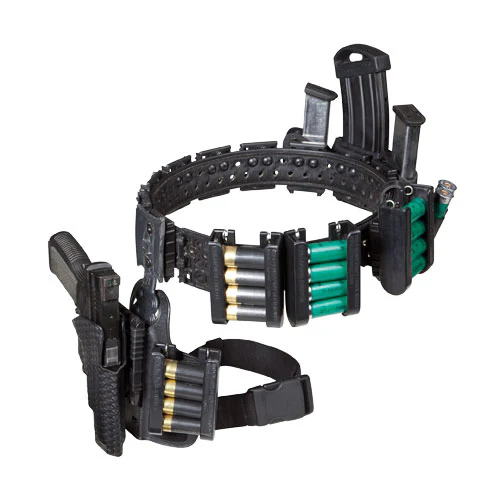
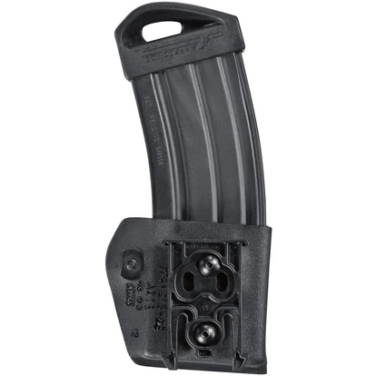
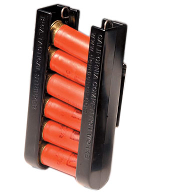

# Índice

- [Índice](#índice)
- [Lore](#lore)
  - [Dossiê: Vincent "Vince" Ferrara](#dossiê-vincent-vince-ferrara)
- [Ficha do Vince:](#ficha-do-vince)
- [Arsenal Balístico](#arsenal-balístico)
    - [**FCB-308 "Chimera" (Ferrara Custom Bullpup)**](#fcb-308-chimera-ferrara-custom-bullpup)
    - [**AMT Automag III Custom**](#amt-automag-iii-custom)
    - [**STI Edge 2011 Custom**](#sti-edge-2011-custom)
    - [**Benelli M3 Custom**](#benelli-m3-custom)
- [Arsenal Químico](#arsenal-químico)
    - [**Granadas Químicas "Green Gas" (CR/Cloropicrina):**](#granadas-químicas-green-gas-crcloropicrina)
    - [**Explosivos:**](#explosivos)
- [**Gadgets**](#gadgets)
    - [**Race Rig: Safariland 012 + Cinto CR Speed**](#race-rig-safariland-012--cinto-cr-speed)
    - [**Porta-Carregadores de Roletes (Safariland 771)**](#porta-carregadores-de-roletes-safariland-771)
    - [**Coldre Velado de Kydex (Blade-Tech IWB)**](#coldre-velado-de-kydex-blade-tech-iwb)
    - [**CCW Tactical Strippers**](#ccw-tactical-strippers)
    - [**Bringandina Modular AR500**](#bringandina-modular-ar500)
- [**Notas Sobre o Estilo de combate do Vince**](#notas-sobre-o-estilo-de-combate-do-vince)
    - [IPSC Specialist (Homebrew Merit -2PB):](#ipsc-specialist-homebrew-merit--2pb)
    - [Inventario de Granadas e Munições:](#inventario-de-granadas-e-munições)
- [📂 HF TECHNOLOGY - THREAT RESPONSE LOG](#-hf-technology---threat-response-log)
    - [📄 ENTRY #001: "The Wake-Up Call"](#-entry-001-the-wake-up-call)
    - [📄 ENTRY #014: "The Farm Siege"](#-entry-014-the-farm-siege)
    - [📄 ENTRY #023: "The Alpha Intruder"](#-entry-023-the-alpha-intruder)
    - [📝 Inventário de Defesa da Propriedade](#-inventário-de-defesa-da-propriedade)
- [Trilha Sonora](#trilha-sonora)
    - [**"Red Soil, Lead Harvester"**](#red-soil-lead-harvester)

---

# Lore

## Dossiê: Vincent "Vince" Ferrara

**Status:** Ativo

**Idade:** 32 anos

**Ocupação:** Engenheiro Mecatrônico / Sócio-Fundador da HF Technology

**Conceito:** Engenheiro de Combate / Glass Cannon

**Natureza/Comportamento:** Perfeccionista / Autista (Focado/Analítico)

1. **Histórico e Carreira**
   
   Nascido em uma família tradicional de produtores rurais, Vince sempre teve uma relação diferente com o campo: enquanto outros viam colheitas, ele via a mecânica dos tratores. Aos 12 anos, já desmontava e consertava o maquinário pesado da fazenda, demonstrando uma aptidão técnica prodigiosa.
   O seu interesse por armas de fogo seguiu a mesma lógica analítica. Longe da cultura de caça, Vince encontrou no tiro esportivo uma disciplina de precisão e controle. Começou com rifles de ar na juventude e migrou para o IPSC (Tiro Prático) assim que atingiu a idade permitida, competindo em circuitos regionais durante toda a sua vida adulta. Para Vince, o tiro não é violência; é balística aplicada e memória muscular.
   Sua mente analítica o levou ao MIT (Massachusetts Institute of Technology), onde se formou em Engenharia Mecatrônica. Foi lá que conheceu Chris Herrera, um colega brilhante com quem fundou a HF Technology (Herrera & Ferrara). A empresa, especializada em automação industrial e robótica pesada, tornou-se referência no setor, garantindo a Vince uma fortuna considerável (Recursos 5) e acesso irrestrito a tecnologias de ponta.
   Apesar da riqueza, Vince manteve suas raízes. Herdou parte das terras da família, mas optou por arrendar o cultivo para seu irmão, Bruno, mantendo para si apenas a antiga sede e o galpão principal, que converteu em residência e laboratório de P&D de alta segurança.

2. **O Incidente (1996)**
   
   A visão de mundo de Vince foi fraturada em 1996, durante uma consultoria técnica em uma metalúrgica cliente da HF. Chamado para investigar a falha catastrófica de uma prensa hidráulica de 50 toneladas, fizeram de **tudo** (incluindo controle mental) para convencer Vince de que a causa do acidente foi "fadiga de material", mas ele rejeitou o laudo oficial.
   Sua análise forense e o acesso às gravações de segurança revelaram o impossível: um intruso humanoide parando o maquinário colossal com as próprias mãos para extrair um objeto, antes de desaparecer em uma velocidade que desafiava a física. Aquilo não era uma falha mecânica; era uma violação das leis naturais.

3. **A Escalada e o Ataque (Início de 1997)**
   
   Movido por uma curiosidade científica obsessiva (Defeito: Curiosidade), Vince iniciou uma investigação digital para encontrar padrões de "acidentes industriais" semelhantes. Sua busca atraiu a atenção errada.
   No início de 1997, sua fazenda foi invadida por um grupo de "agentes de limpeza" (carniçais) enviados para silenciá-lo. Vince sobreviveu apenas graças à sua competência no IPSC e ao conhecimento do terreno, mas a mensagem foi clara: ele estava lidando com predadores organizados e fisicamente superiores. Vince entendeu que a diplomacia era inútil e recuou estrategicamente, usando a desculpa de "projetos confidenciais da HF" para se isolar e preparar uma resposta.

4. **O Hiato e o Preparo* (1997-1999)**
   
   Nos dois anos seguintes, Vince transformou sua oficina em uma fábrica de contramedidas. Incapaz de competir fisicamente com o sobrenatural, ele focou na superioridade tecnológica ("Engenharia de Combate"):
   Balística Avançada: Desenvolveu munições experimentais (API e Incendiárias de Magnésio) para anular a resistência física e a regeneração dos alvos.
   Proteção: Adaptou chapas de aço AR500, usadas em máquinas da HF, para criar uma Brigandina moderna — uma armadura corporal capaz de suportar danos massivos sem sacrificar totalmente a mobilidade.
   Mobilidade Tática: Adquiriu e modificou um protótipo da nova Mitsubishi Pajero 4M41, hackeando a ECU e instalando sistemas industriais para criar um veículo de extração robusto.

5. **Status Atual (1999)**
   
   Vince reemerge na sociedade em 1999. Aos olhos de seus antigos amigos, ele é o mesmo engenheiro de sucesso, talvez apenas mais sério e observador. Na realidade, ele é um caçador metódico que não busca heroísmo, mas eficiência. Ele encara os vampiros não como monstros místicos, mas como problemas de engenharia complexos que requerem soluções térmicas e cinéticas definitivas.

---

# Ficha do Vince:

1. Attributes
   1. Physical
      1. Strength: 2
      2. Dexterity: 4 (-5 PB)
      3. Stamina: 2
   2. Social
      1. Charisma: 1
      2. Manipulation: 3
      3. Appearance: 2
   3. Mental
      1. Perception: 3 (-5 PB)
      2. Intelligence: 5 (-5 PB) 
      3. Wits: 3
2. Abilities
   1. Talents:
      1. Alertness: 2
      2. Athletics: 2
      3. Dodge: 2 (-2 PB)
   2. Skills:
      1. Drive: 2
      2. Firearms: 4
      3. Repair/Engineering: 5 (-2 PB)
      4. Security: 1
      5. Stealth: 2 (-2 PB)
      6. Survival: 1
   3. Knowledges:
      1. Computer: 3
      2. Investigation: 2 (-2 PB)
      3. Medicine: 1
      4. Science: 4
3. Advantages:
   1. Background
      1. Resources: 5
      2. Contacts: 1 (-1 PB)
   2. Virtues:
      1. Conscience: 2
      2. Self-Control: 4
      3. Courage: 4
      4. Humanity: 6
      5. Willpower: 5 (-1 PB)
      6. Faith: 0
   3. Merits:
      1. Iron Will (Lore: Vince superou lavagem celebral de um vampiro) (-3 PB)
      2. Concentration (Vince é capaz de entrar em hiperfoco) (-1 PB)
      3. IPSC Specialist (-2 PB)
   4. Flaws:
      1. Impatient with People (+1 PB)
      2. Dark Secret (Vince consegue comprar materia prima de forma legal e sem suspeita, mas não tem licensa para fabricar explosivos na escala que tem feito) (+2 PB)
      3. Enemy (Vince está sedo caçado por vampiros pois "Sabe Demais") (+3 PB)
      4. Curiosity (+2 PB)
      5. Obsession / Compulsion: Research or Engineering (Ele não consegue deixar um problema técnico/sobrenatural sem resolver) (+2 PB)

---

# Arsenal Balístico

### **FCB-308 "Chimera" (Ferrara Custom Bullpup)**

   *Protótipo de Fuzil Bullpup Calibre 7.62x51mm projetado e construído pelo Vince.*
   1. **Base:** Mecanismo AR10/FAL modificado para Bullpup.
   2. **Munição Especial:** 7.62mm API (Armor-Piercing Incendiary) Caseira.
   3. **Ponto Fraco:** Por ser um protótipo, o equipamento está propenso a falhas:
      1. **Falha Leve:** Falha de extração.
      2. **Falha Crítica (1 em tudo):** Sistema de gás é danificado inutilizando a arma.
   4. **Regra:** 
      1. **Dano:** O dano base é 8 dados.
         1. Inimigos sem Fotitude recembem +1 de dano Agravado
         2. Rötschreck: O alvo atingido precisa fazer teste de coragem (Diff 5)
      2. **Bônus:** 
         1. *Mira Holográfica* +1 dado em testes de mira e precisão.
         2. *Munição API*

### **AMT Automag III Custom**

   *Pistola .30 Carbine Customizada pelo Vince. É um canhão de mão para caçar monstros. Possui carregador estendido de 12 munições.*
   1. **Customização:** Compensador de recuo superdimensionado para melhorar controle ou supressor para abafar sons de disparo.
      1. **Supressor:** Aumenta a Dificuldade de Percepção dos inimigos para ouvir o tiro.
      2. **Compensador:** Diminuir a Dificuldade do seu segundo tiro no mesmo turno (tiro rápido).
   2. **Munição:** .30 Carbine "Hot Load" (Pólvora de queima rápida + Ponta Oca com Óxido de Prata ou Magnésio).
      1. **Munição de Magnésio:**
         1. Inimigos sem Fotitude recembem +1 de dano Agravado
         2. **Contra Vampiros:** Rötschreck: O alvo atingido precisa fazer teste de coragem (Diff 5)
      2. **Munição de Prata Contra Lobisomens:** O dano é Agravado e não pode ser absorvido.
   3. **Regra:**
      1. **Dano:** 6 dados.
      2. **Bônus:** *Red Dot* +1 dado em testes de mira e precisão.

###  **STI Edge 2011 Custom**

   *Pistola 1911 9mm modernizada e customizada para competições de tiro. Capaz de atirar em alta velocidade sem perder a precisão. Possui carregador de 20 munições. Arma de porte diário do Vince.*
   1. **Regra:** 
      1. **Dano:** Letal, 4 dados.
      2. **Bônus:** 
         1. *Red Dot:* +1 dado em testes de mira e precisão.
         2. *Race Gun:* -1 de dificuldade em todas as ações com a arma

### **Benelli M3 Custom**

   *Escopeta Customizada do Vince. Utilizada tanto para competições quanto defesa. Capacidade de 10+1 munições.*
   1. **Seletor Híbrido:** Permite alternar entre Semi-Auto e Pump-Action para munições de cargas diferentes.
   2. **Munições:**
      1. **00 Buckshot:** Utiliza dano físico básico, pode ser combinado com choker de spread.
      2. **Slug:** Utiliza dano físico básico, é um balote sólido de chumbo.
      3. **Sabot Slug:** Um balote de Tungstênio numa cápsula de resina. Feito para penetrar blindagem. Ignora armadura (Regra do V20/HH2).
         1. Utiliza carga pesada de propelentes, pode danificar a arma se utilizado em modo semi-automatico.
      4. **Dragon's Breath:** Munição de magnésio que causa efeito incendiário, tem dano reduzido para 4, porém Agravado. Pode utilizar chokers.
   3. **Regra de Dano:** 8 Dados.

---

# Arsenal Químico

### **Granadas Químicas "Green Gas" (CR/Cloropicrina):**
   *Granadas de gás feitas duma mistura de CR e Cloropicrina. Causam inflamação das mucosas e cegueira. Podem preencher por completo um ambiente fechado ou um raio de até 3m em céu aberto. O gás não é letal, mas é um dos poucos quimicos que funciona contra vampiros.*
   1. **Regra:** A vítima rola teste de resistência Dificuldade 8
      1. **Falha:** A vítima fica Cega e com Dor Extrema. **Penalidade de -3 dados em todas as ações**.
      2. **Falha Crítica:** A vítima inala altas quantidades de gás. **Incapacitada (só pode se arrastar enquanto engasga no próprio vômito)**.

### **Explosivos:**
   1. **Kit de Demolição Binária (PLX):**
      *Explosivo plástico caseiro feito misturando nitrometano e etilenodiamina, usado para demolição e arrombamento. Em caso de vistoria, pode se passar por combustível de corrida e produtos de limpeza.*
   2. **Eritritol Tetranitrato (ETN):**
      *É um agente oxidante, quando queima libera oxigênio.*
      1. Pode ser utilizado como aditivo em explosivos ou para se salvar de um sufocamento.
   3. **Ácido Pícrico:**
      *Um líquido amarelo que parece tinta. É inofensivo quando úmido, mas ao secar se torna um explosivo altamente reativo que sofre ignição com um pouco de atrito ou leve pancada. Ótimo para fazer armadilhas.*
   4. **Estrela da Manhã:**
      *Uma granada incendiária e uma flashbang se amaram muito e tiveram um filho*
      1. **Receita especial do Vince:**
      *Vince mói o nitrato de amônio em um moinho de bolas até virar talco. Depois, mistura com o pó de magnésio e adiciona a limalha de alumínio da sua fresadora. O resultado é um pó cinza que, quando detonado, cria um explosivo incendiario de 3.000°C e um flash de luz tão intenso que, a curta distancia, parece um sol verdadeiro.*
      2. **Composição detalhada:**
         1. **ANFO:** Nitrato de amônio extraído de fertilizantes, triturado e misturado com combustível líquido (Diesel, Gasolina, Etanol, Metanol ou Nitrometano). Vince utiliza Nitrometano para maximizar o poder explosivo.
         2. **Pó de Alumínio:** Serve para aumentar a temperatura da reação através das reações de alumínio com óxidos.
         3. **Magnésio:** Metal que quando entra em combustão emite luz branca muito forte e uma grande quantidade de raios UV-A e UV-B.
         4. **ETN:** Aditivo oxidante.
      3. ***Nota:*** *Olhar diretamente para a detonação desse explosivo sem proteção (como mascaras/oculos de solda) pode causar danos permanentes a visão.*
      4. **Regra:**
         - **Dano:** 4 Agravado (fogo) em raio de 3m do epicentro
         - **Flash:** Todos em 5m testam Destreza + Prontidão (dif 8) ou ficam cegos por 1d3 turnos
         - **Rötschreck:** Vampiros testam Coragem (dif 9) ou entram em Pânico
         - **Dano Permanente:** Quem olhar diretamente sem proteção perde 1 ponto de Percepção por queimaduras na retina (falha crítica)

         ***Cuidado com o Friendly Fire!***

---

# **Gadgets** 

 

### **Race Rig: Safariland 012 + Cinto CR Speed**

   

   *Este equipamento elimina o atrito. A arma não é "sacada", ela "aparece" na mão.*

   **Regra Especial: "Zero Drag Draw"**
   1. **Efeito (Iniciativa):** Se Vince declarar que vai sacar a arma no início do turno, ele soma **+1 na Iniciativa final**. (A arma sai do coldre antes que o inimigo termine de piscar).
   2. **Efeito (Saque Rápido):** O teste de Saque Rápido (Fast Draw) tem **Dificuldade -2 em saque rápido.**
   3. **Penalidade (A Falha do Equipamento):** Este coldre não tem retenção de segurança. Se Vince sofrer um Knockdown ou tentar fazer acrobacias, ele deve testar Destreza + Esportes (Diff 5). Se falhar, a arma cai no chão.

### **Porta-Carregadores de Roletes (Safariland 771)**

   *A recarga no V20 geralmente consome um turno ou exige dividir a parada de dados.*

   **Regra Especial: "Lightning Reload"**
   1. **Efeito:** Quando for recarregar, diminui penalidade por ação multipla em 2, SOMENTE PARA RECARGAS.
   2. **Requisito:** Vince precisa ter munição nesses porta-carregadores específicos. Se ele tirar do bolso da calça ou outro porta-carregadores, é a regra normal.
   3. **Na Narrativa:** "Enquanto a mão direita ainda está disparando o último tiro, a esquerda já está com um novo carregador cheio. O ciclo não para."
   4. **Penalidade:** Este porta-carregadores é de baixa retenção. Se Vince sofrer um Knockdown ou tentar fazer acrobacias, ele deve testar Destreza + Esportes (Diff 5). Se falhar, as munições caem no chão.

### **Coldre Velado de Kydex (Blade-Tech IWB)**

   

   *Para quando você precisa ser discreto, mas letal.*

   **Regra Especial: "Concealment Profile"**
   1. **Efeito:** Diferente de coldres de couro que "imprimem" (mostram o contorno da arma), o Kydex mantém a arma colada no rim. Adiciona +1 dados em qualquer teste para esconder a arma no corpo (Destreza + Furtividade/Lábia).
   2. **O Saque:** Permite sacar a arma sem a penalidade padrão de "Arma Escondida". A dificuldade é a padrão, pois o coldre mantém a boca aberta e rígida.

### **CCW Tactical Strippers**

   

   *Clipes de polímero reforçados com molas de lâmina de aço. Vince pode carregar até 4 desses no cinto, permitindo que ele arranque punhados de munição sem olhar.*

   **Regra Especial: "Stripper Clip Reload"**
   1. **Efeito:** Permite carregar 4 cartuchos por ação (em vez de 2). Tecnica de Quad-Load.
   2. **Vantagem Tática:** Esses clipes são compactos. Se o Vince estiver de jaqueta, eles mal aparecem.
   3. **Penalidade:** Este porta-capsulas é de baixa retenção. Se Vince sofrer um Knockdown ou tentar fazer acrobacias, ele deve testar Destreza + Esportes (Diff 4). Se falhar, as munições caem no chão.

### **Bringandina Modular AR500**

   

   *Um design de armadura medieval reprojetado com materiais modernos. É modular para reparos faceis, não afeta mobilidade e possui sistema de absorção de traumas. Porém é pesado pra caralho e cansativo de usar.*

   - **Proteção:** +4 dados de absorção.
   - **Cobertura:** Torso e braços apenas
   - **Penalidades:** -1 Stamina e Dexterity, +1 Dificuldade em Stealth

---

# **Notas Sobre o Estilo de combate do Vince**

### IPSC Specialist (Homebrew Merit -2PB):
   - Vince possui uma execelente memoria muscular graças ou treino extensivo de:
     - El Presidente Drill
     - F.A.S.T. Drill
     - The Bill Drill
     - Mozambique Drill
     - V-Drill
     - 1-Reload-1
     - Quad-Load
     - Double Tap
  - **Regra:**
     - O custo de ações multiplas diminui em 2 ao executar qualquer drill (ou variação delas)
     - Como atirador profissional no IPSC, Vince consegue atirar e recarregar armas enquanto se movimenta com penalidades reduzidas (0 andando, +1 correndo)
     - Não se aplica a combate corpo-a-corpo, outras habilidades ou ações não listadas

---

### Inventario de Granadas e Munições:
   Vince possui um limite de items que pode levar consigo:
   1. Cinto 8 Slots:
      1. Porta carregadores: 1 slot cada (pistola ou rifle)
      2. Porta capsulas: 1 slots cada (12ga)
      3. Coldres: 2 Slots
      4. Granadas/Explosivos: 2 slots
   *Os equipamentos Safariland só podem ser utilizados no cinto.*
   2. Bolsos 12 Slots (Vince ama calças cargo)
      1. Carregadores de pistola: 1 slot
      2. Carregadores de Rifle: 2 slots
      3. Capsulas de 12ga: 4 -> 1 slot
      4. Granadas e explosivos: 2 slots
   3. Bringadina (20 slots, -1 Stamina quando equipado)
      1. Carregadores de pistola: 1 slot
      2. Carregadores de Rifle: 2 slots
      3. Capsulas de 12ga: 4 -> 1 slot
      4. Granadas e explosivos: 2 slots
   4. **HF Multitool:** Ferramenta fabricada pela empresa do Vince, contem:
      1. Canivete
      2. Alicate
      3. Kit de Chaves de Precisão
      4. Régua de precisão
      5. Lixa/Lima
      6. Kit de Lockpicking

---

# 📂 HF TECHNOLOGY - THREAT RESPONSE LOG
**User:** V. "Engineer" | **Clearance:** Level 5 | **Subject:** Field Testing / Incident Reports

### 📄 ENTRY #001: "The Wake-Up Call"
- **Local:** Estacionamento Subterrâneo, Sede da HF Technology. 
- **Horário:** 23:45. 
- **Ameaça:** 1x Vampiro Neonato (Classificação Desconhecida). 
- **Loadout:** Pistola Compacta 9mm (Porte Velado Padrão).
- **Relatório:** Alvo abordou o veículo blindado tentando quebrar o vidro do motorista com força sobre-humana. Desembarquei e engajei.
  - **Dados Balísticos:** 15 disparos efetuados no centro de massa (Torso). Efeito nulo. O alvo ignorou o choque hidrostático e a dor. A munição FMJ atravessou o tecido morto sem transferir energia suficiente.
  - **Desfecho:** Sobrevivência garantida apenas via atropelamento tático e fuga em alta velocidade.
- **Conclusão:** A física convencional falha contra a biologia deles. Se não sangram, balas comuns são apenas "incômodos".
- **Ação:** Início do P&D do Projeto CHIMERA.

### 📄 ENTRY #014: "The Farm Siege"
- **Local:** Perímetro Norte da Fazenda. 
- **Ameaça:** 4x Carniçais Armados (Facões e Barras de Ferro). 
- **Alerta:** Comoção dos Gansos. A variação no padrão de grasnado indicou intrusos.
- **Relatório:** Invasores tentaram flanquear o galpão de máquinas.
  - **Engajamento:** Teste de campo do protótipo FCB-308 Chimera.
        1. **Disparo 1:** Alvo Líder atingido no esterno. Munição API (Lote 1). Combustão imediata da caixa torácica. Baixa confirmada.
        2. **Falha Mecânica:** O sistema de gás do fuzil falhou em ciclar a pressão extra da munição.
        3. **Transição:** Abandono da arma primária. Saque da STI Edge. Execução de Mozambique Drill em movimento diagonal reverso.
        4. **Desfecho:** 2 Baixas letais. 2 Inimigos tentaram fugir em pânico. Continuei disparando contra as costas dos alvos em fuga até que caíssem mortos ou sumissem de vista.
   
*Nota: Os gansos terminaram o serviço com os que caíram perto da cerca. Ninguém sai da minha propriedade vivo se entrar sem convite.*

### 📄 ENTRY #023: "The Alpha Intruder"
- **Local:** Varanda da Casa Principal. 
- **Ameaça:** Entidade de Nível Superior (Vampiro com modificações corporais visíveis - Provável Tzimisce ou Gangrel). 
- **Alerta:** Comoção dos gansos seguido de silencio. Alerta assumido por sensores de movimento sísmico.
- **Relatório:** Alvo rompeu o portão externo como se fosse papelão. Blindagem dérmica visível (pele cinza/óssea).
  1. **Engajamento:** O alvo resistiu a dois disparos de espingarda calibre 12 no peito sem recuar.
  2. **Solução:** Uso da Chimera (Revisada) com Munição Dragonfly v2.
  3. **Tática:** Double Tap no centro de massa.
  4. **Efeito:** A blindagem do alvo absorveu o impacto cinético, mas a carga de magnésio detonou dentro da musculatura.
  5. **Desfecho:** O alvo não morreu pelo tiro, mas a reação exotérmica causou falha catastrófica na moral. A entidade abortou o ataque e recuou para a mata. Continuei disparando contra as costas do alvo em fuga até que ele sumisse de vista.
- **Conclusão:** O medo é uma arma mais confiável que o dano. Munição Dragonfly aprovada.
  
   *Nota: Achei que fosse morrer quando ele absorveu os disparos iniciais.*

### 📝 Inventário de Defesa da Propriedade
- **Câmeras:** 12x Câmeras IP com visão noturna (HF Tech Custom).
- **Sensores:** 8x Sensores de Movimento Sísmico (Detectam passos pesados).
- **Bio-Sensores (Gansos):** 20x Gansos Sinaleiros (Atuais: 6 Vivos).

   *Nota 1: Comprar mais gansos. Eles detectaram as ameaças antes da eletrônica.*
   
   *Nota 2: Terei de cavar um tumulo pros falecidos.*

---

# Trilha Sonora

### **"Red Soil, Lead Harvester"**
**Gênero:** *Experimental Doom Metal fused with Brazilian Sertanejo Raiz and Industrial*

**Estilo:**
* **[Intro]** features bright, metallic acoustic folk guitar (twangy sound) playing a minor key melody.
* **[Verses]** are slow, heavy, atmospheric, with deep male vocals (Peter Steele style).
* **[Chorus]** shifts to Fast Tempo, aggressive Industrial Metal beat, repetitive and catchy hook, heavy distortion, mechanical rhythm, Dark, gritty, agricultural horror atmosphere.

**Letra:**

> **[Intro]**
>
> **[Verse 1]**
> The red dust settles on the skin
> Where the silence ends, and the gears begin
> No heartbeat found in the chest of steel
> Only the weight of the turning wheel
> They look for mercy in the hollow dark
> But the engine leaves... a permanent mark.
>
> **[Pre-Chorus]**
> Calculated... Cold...
> The story ends... before it's told.
>
> **[Chorus]**
> Grind the bone! Feed the soil!
> Years of rust! Years of toil!
> Run if you can, but the math is done
> There is no shelter! There is no sun!
> Face the gear! Face the blade!
> The debt of blood is fully paid!
>
> **[Verse 2]**
> Something ancient screams in the night
> Something modern kills the light
> I feel the trembling of the ground
> A frequency... a low-end sound
> It’s not anger, it’s not hate
> It’s just the crushing weight of fate.
>
> **[Pre-Chorus]**
> System engaged... Target locked...
> The door to the soul... is double-locked.
>
> **[Chorus]**
> Grind the bone! Feed the soil!
> Years of rust! Years of toil!
> Run if you can, but the math is done
> There is no shelter! There is no sun!
> Face the gear! Face the blade!
> The debt of blood is fully paid!
>
> **[Bridge]**
> Efficiency is the only morality.
> Flesh is temporary.
> Steel is forever.
>
> **[Verse 3]**
> The smoke is rising, black and thick
> The cure is painful... for the sick
> Walk away from the burning field
> Witness the power that refuses to yield.
>
> **[Chorus]**
> Grind the bone! Feed the soil!
> Years of rust! Years of toil!
> Run if you can, but the math is done
> There is no shelter! There is no sun!
> Face the gear! Face the blade!
> The debt of blood is fully paid!
>
> **[Outro]**
> Grind the bone! Feed the soil!
> ...